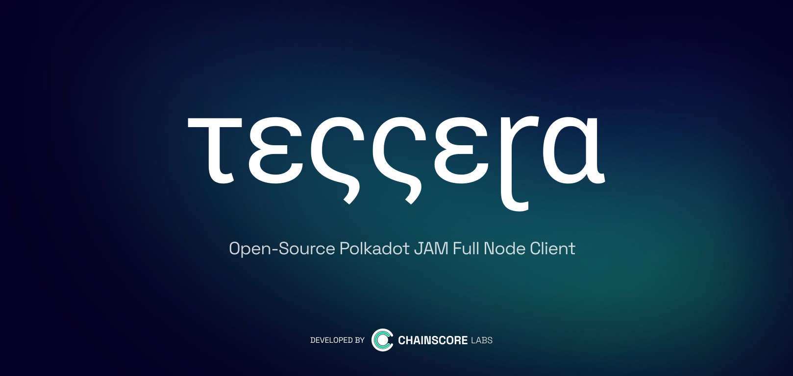

[](https://www.gnu.org/licenses/gpl-3.0)
[](https://www.python.org/downloads/)
[](https://github.com/Chainscore/tessera/actions)

# Tessera

Tessera is Chainscore Labs' Python implementation of the JAM protocol. It includes the JAM state transition, Safrole, PVM execution, block validation, RocksDB-backed state storage, and node networking.

## Releases

Release artifacts are published from tagged builds.

- Binary releases: https://github.com/Chainscore/tessera-releases/releases
- Docker image: `ghcr.io/chainscore/tessera:<version>`
- Latest Docker tag: `ghcr.io/chainscore/tessera:latest`

Binary assets on the release page:

| Platform | Asset |
|---|---|
| Linux x86_64 | `tessera-node-Linux-x64.tar.gz` |
| macOS Apple Silicon | `tessera-node-Darwin-arm64.tar.gz` |
| macOS Intel | `tessera-node-Darwin-x64.tar.gz` |

## Binary Usage

Download the asset for your platform from the release page, extract it, then run:

```bash
./tessera-node --help
```

Run a node:

```bash
./tessera-node --env envs/40000.env
```

Run the fuzzer target directly:

```bash
./tessera-node --fuzzer --socket /tmp/jam_conformance.sock
```

Import traces or vectors:

```bash
./tessera-node --import /path/to/traces
```

## Docker Usage

Pull a release image:

```bash
docker pull ghcr.io/chainscore/tessera:<version>
```

The Docker image has one entrypoint with three modes.

### Single Node

Default mode starts one node from `envs/40000.env`. `Disabled Temporarily`

```bash
docker run --rm ghcr.io/chainscore/tessera:<version>
```

Select a different bundled node env:

```bash
docker run --rm \
  -e TESSERA_NODE=40002 \
  ghcr.io/chainscore/tessera:<version>
```

or pass the env file path directly:

```bash
docker run --rm \
  -e TESSERA_ENV=envs/40002.env \
  ghcr.io/chainscore/tessera:<version>
```

### Six-Node Testnet

`TESTNET=1` starts `envs/40000.env` through `envs/40005.env`. `Disabled Temporarily`

```bash
docker run --rm \
  -e TESTNET=1 \
  ghcr.io/chainscore/tessera:<version>
```

### Fuzzer Target

`JAM_FUZZ=1` starts the JAM conformance socket target. `FUZZ_MODE=on` is also accepted as an alias.

```bash
mkdir -p /tmp/tessera-data /tmp/tessera-sock

docker run --rm \
  -e JAM_FUZZ=1 \
  -e JAM_FUZZ_SPEC=tiny \
  -e JAM_FUZZ_DATA_PATH=/data \
  -e JAM_FUZZ_SOCK_PATH=/sock/jam_target.sock \
  -e JAM_FUZZ_LOG_LEVEL=info \
  -e JAM_PRUNE_BLOCK_HISTORY=0 \
  -v /tmp/tessera-data:/data \
  -v /tmp/tessera-sock:/sock \
  ghcr.io/chainscore/tessera:<version>
```

Use `JAM_FUZZ_SPEC=full` for full-spec conformance runs. Block-history pruning is disabled by default for fuzzing so `GetState` can still inspect older imported blocks; set `JAM_PRUNE_BLOCK_HISTORY=1` to enable bounded historical DB pruning.

## Source Development

Requirements:

- Python 3.12
- `uv`
- RocksDB system library
- Rust toolchain for dependencies that build native extensions

Setup:

```bash
git clone --recursive https://github.com/Chainscore/tessera.git
cd tessera

curl -LsSf https://astral.sh/uv/install.sh | sh
uv python install 3.12

export PYO3_USE_ABI3_FORWARD_COMPATIBILITY=1
uv sync --all-extras
mkdir -p data/
```

Run from source:

```bash
uv run jam --env envs/40000.env
```

Build the local binary:

```bash
./build-binary.sh
./dist/tessera-node --help
```

Build the local Docker image:

```bash
./build-docker.sh chainscore/tessera local
```

## Testing

```bash
uv run pytest tests/
```

More command examples live in [COMMANDS.md](COMMANDS.md).

## Architecture

- `jam/state/`: JAM state model and transition orchestration
- `jam/state/transitions/`: Safrole, accumulation, authorization, reports, disputes, and related transition logic
- `jam/execution/`: PVM execution, invocations, host calls, and service execution
- `jam/block/`: block/header/extrinsic validation
- `jam/networking/`: QUIC-based node networking
- `jam/db/`: RocksDB-backed persistence
- `jam/cli.py`: binary/fuzzer/import CLI entry point

## License

GNU General Public License v3.0. See [LICENSE](LICENSE).

Copyright (c) 2025 [Chainscore Labs](https://chainscorelabs.com/)
