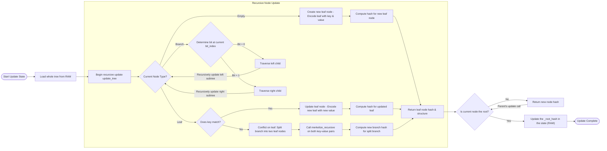

# ADR-0002: State Storage Design 

## Status
Accepted

## Context
Our initial prototype rebuilt the entire Merkle trie in RAM on every block, which quickly became a bottleneck as the state grew. We need a design that only rehashes the branch from a modified leaf up to the root, persists only the affected nodes, and still produces the correct global state root.

## Decision  
We adopt a **persistent Merkle‑Patricia‑style trie** in RAM with a secondary mapping from each node’s hash to a `DBNode` object. Key points:

1. **Full In‑RAM Trie with Partial Persistence**  
   - Keep two dictionaries in memory:  
     - `_nodes: NodeHash → EncodedNode`  
     - `_db_nodes: NodeHash → DBNode`  
   - On startup or clear, both are empty and the root hash is `ZERO_HASH`.

2. **Path‑Based Updates**  
   - **`find_path(key)`** walks the current RAM trie (via `_db_nodes`) using the bits of the 32‑byte key to collect the chain of node‐hashes from the root down to the leaf (or empty).  
   - **`update_path(key, new_value)`**:  
     1. Locate the old leaf (error if not found).  
     2. Encode and hash the new leaf, insert into both RAM maps.  
     3. Walk back up the saved path, at each branch node:  
        - Re‑encode it with the updated child hash (left or right depending on the key bit)  
        - Re‑hash and re‑insert into both RAM maps as a new `DBNode`  
     4. Set the trie’s `_root_hash` to the new root.  

3. **Batch Updates**  
   - **`update_global_root(updates)`** simply calls `update_path` on each key→value pair in turn.  
   - This amortizes path‑finding overhead when many leaves change in one block.

4. **Optional KV Persistence**  
   - The prototype Merklization API (`merkelize(state_dict, db)`) still supports writing out every leaf value to an external `KVStore` if one is provided, but the normal update path only touches the RAM structures.  

## Iteration 1 State Update Flow 

## Consequences

### Positive  
- **Minimal Work per Update**  
  - Only the branch from the modified leaf to the root is re‑hashed, not the entire trie.  
  - Amortized performance when updating many keys in a block.

- **Quick Proofs Generation**  
  - We still have every intermediate _nodes, so we can produce Merkle‑proofs or epochal roots on demand.

- **Efficient In-Memory Trie Storage**
  - The complete Merkle trie structure is maintained in RAM for optimal performance
  - This enables rapid traversal and modification of the trie data structure.

### Negative  
- **RAM Overhead**  
  - We keep every active node in memory; if the trie grows to millions of nodes this could be substantial.  

- **Garbage Collection Overhead**  
  - Old/Unwanted _nodes and _db_nodes key values may linger until GC or manual pruning.

- **Concurrency**  
  - The current implementation is single-threaded with no parallel execution, which limits performance. Future optimizations could include:
    - Parallel processing of independent subtree updates
    - Concurrent merkle proof generation
    - Thread-safe node caching
    - Lock-free data structures for the trie

