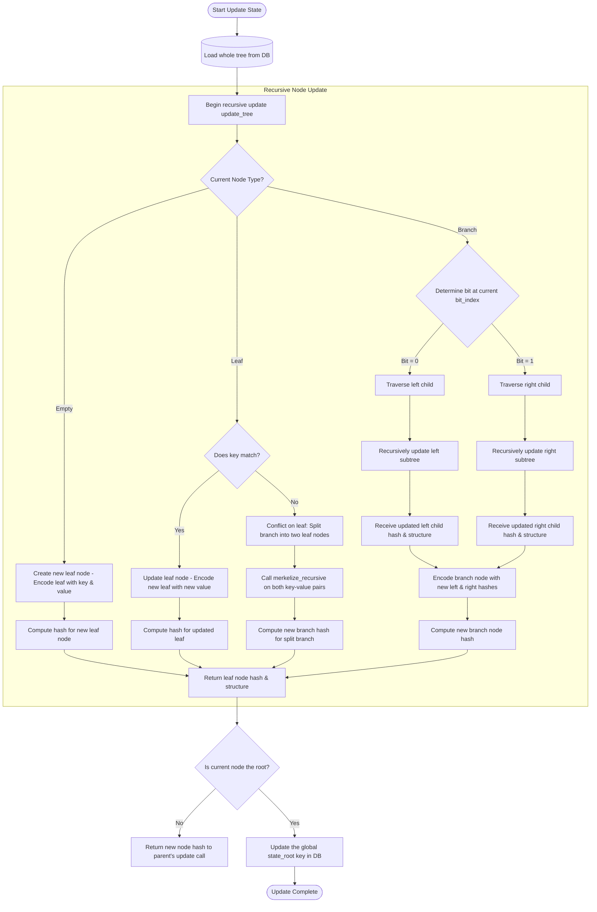

# ADR-0002: State Storage Design (Pending)

## Status
Draft

## Context
To implement the first draft of Tessera node design, defining how the node should be architectured to function from start
to end.

## Content

- Iterations for state root update (2)

## Iteration 1 State Update Flow (Current)

### Pros
- Simple to implement
- Easy to understand

### Cons
- Not scalable
- Not maintainable
- Tree of that size is not practical for millions of accounts

## Iteration 2 State Update Flow (Proposed)
