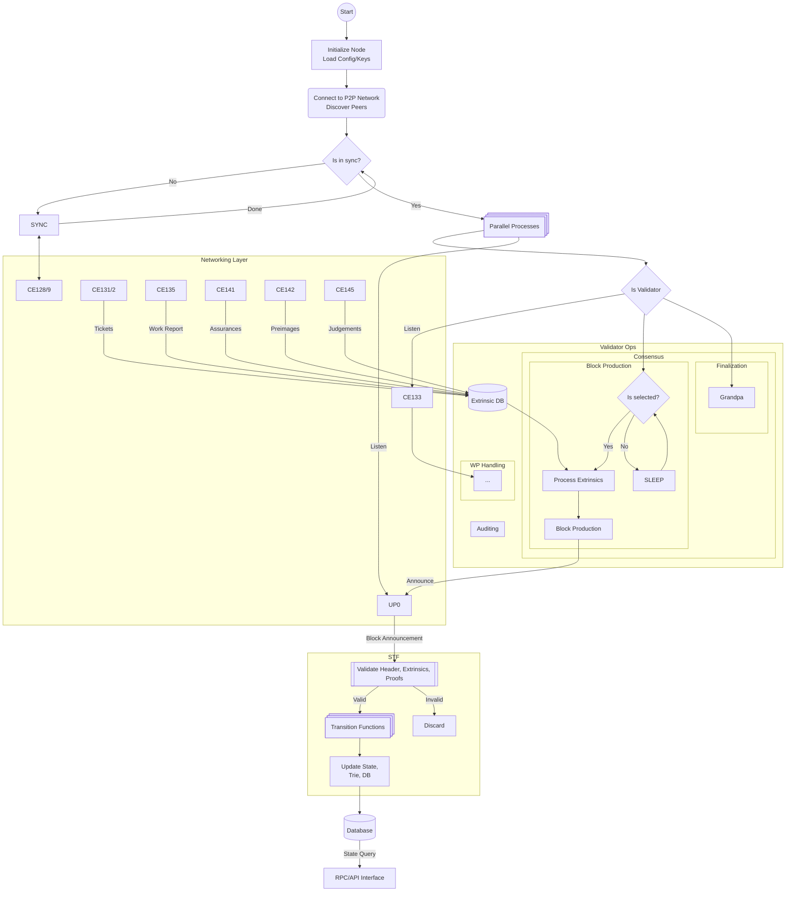

# ADR-0004: Node Design (Pending)

## Status
Draft

## Context
To implement the first draft of Tessera node design, defining how the node should be architectured to function from start
to end.

## Decision

### 1. Start
Client will start as either as:

**1.1. Full-Validator Node**

This is a full node capable of authoring blocks, connecting with other validators to submit extrinsics.

- Keys have to be set in config
  - Bandersnatch
  - ED25519
  - BLS
  - Metadata: Name, Host IP and Port
- Block Author

**1.2 Light Client**

Does not validate, or might not even maintain full state, but it is capable to maintaining just enough state to be able to validate
things. Can request data as needed from a full node.

### 2. Setup Network

TBA

### 3. Synchronization
Use of CE128 and CE129 of JAMNP to request state pieces and block history to reconstruct full state. We also might need block history
for functions like `P` (parent header) or `A` (ancesral set), so we'll also fetch fairly recent blocks. We set this recent number to be
`1 Hour` for now, to be decided later on.

### 4. Async Process Handling
Appropriately handle various functioning process such as
- STF upon block announcement
- Block production (if author)
- WP handling (if active validator)
- Auditing (if active validator)
- Block finalisation 

## Alternatives Considered

### Synchronization: Block-History based 
ETH-node like approach, involves fetching all blocks from genesis to most recent finalised block, and running STFs with 1000s of 
blocks in batches.

- Assumption: We don't have a way to request parts of state from other nodes as state structure might be way too different 
for other implemenations

- Reasoning for rejection: As the state components are defined in GP, differences within implementations' state structure would not be significant.
  So there most likely be RPC APIs for requesting pieces of state and synchronise. Though there might be snapshots at various timeslots, from which
  syncing would be resonable to do.

### Synchronization: State-Reconstuction based on recent Block updates
We want to achieve a more efficient+faster way than Block-History based synchronization. Ideally it could be like we track 2-3 epochs'
blocks to be able to fully reconstruct the state.

Difficult to have a full proof solution as some components are impossible to think how to fully reconstruct like: 
- phi depends on a priviledged service
- beta depending on accumulation result map
- and more...