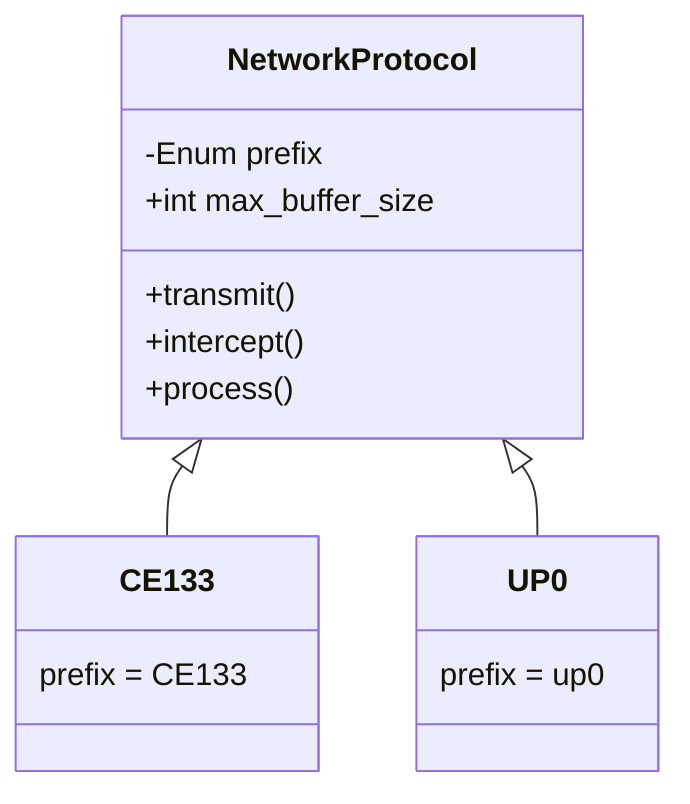

# ADR-0005: Networking System Design (Pending)

## Status
Draft

## Context
To implement the functional structure for protocols establishing communication 
and synchronization amongst Tessera JAM Nodes, 
defining how the protocol should be structured and how to handle different streams.

- Protocol abstractions
- Stream handling patterns
- QUIC configuration
- Certificate and key management
- Constraints such as buffer size and stream data handling

## Decision

### Base Protocol

`NetworkProtocol` is the abstract base class for all protocol types. Each subclass implements ***properties***:

- `is_active`: meta property for status
- `prefix`: PrefixType can be UP0, CE128, CE129 ...
- `max_buffer_size`: Maximum data that can be sent for that protocol

and ***methods***:

- `activate`: a meta fn for setting protocol as active 
- `deactivate`: a meta fn for setting protocol as inactive
- `transmit(node, data)`: fn to send required data
- `intercept(buffer)`: fn to intercept and identify data
- `process(data)`: fn to perform some operations on that data [TBA]

### QUIC
So, for communication we have to use QUIC protocol. We are using [aioquic](https://github.com/aiortc/aioquic) 
which is a python implementation for QUIC protocol.

**_aioquic_** provides us connections and asyncio API. 

In a node we create a quic server at a port and from the same port we initiate client connections to different peers.

Each JAM Node runs a QUIC server and can simultaneously initiate client connections to peer nodes. 
The same port can support both incoming and outgoing streams.

Each **JAM Node** operates a **QUIC server** that listens for incoming connections while also being capable of initiating 
**outgoing client connections** to peer nodes — all over the **same port**. 
This bidirectional capability allows seamless peer-to-peer communication between nodes in the network.

#### Stream Functions

The client implementation exposes two core functions for sending data across QUIC streams:

- **`stream_and_keep_open`**:  
  Sends data on an open stream while keeping the stream **active**. This is useful for long-lived sessions or protocols where multiple messages may be exchanged over the same stream.

- **`stream_and_close`**:  
  Sends the data and **closes the stream immediately** after. This is ideal for short, discrete exchanges where no further communication is expected on that stream.

Each protocol subclass should make use of one of these functions within its `transmit()` method, based on the nature of the protocol it implements. 
The behavior must follow the protocol’s stream lifecycle expectations (whether it's UP stream or CE stream).

#### Intercepting and Processing Data

Once data is received on a stream, it is intercepted by identifying the **prefix** (a unique identifier defined by `PrefixType`) at the start of the message buffer. 
This prefix determines which protocol class is responsible for decoding and handling the message.

- The `intercept(buffer)` method parses the raw bytes into structured data.
- The `process(data)` method then handles the business logic associated with the decoded data, such as verifying a block, updating state, or acknowledging receipt.

#### Buffer Size Enforcement

Every protocol subclass must define a `max_buffer_size` to enforce **stream-level memory safety**. 
This ensures that no single stream can monopolize resources or cause instability due to overly large payloads.

Protocols must:
- Validate the size of outgoing messages before transmission.
- Handle incoming messages defensively, rejecting buffers that exceed the limit.

This system provides a clear contract for all protocols and prevents misbehavior either due to programming errors or malicious payloads.

## Alternatives Considered
NA
