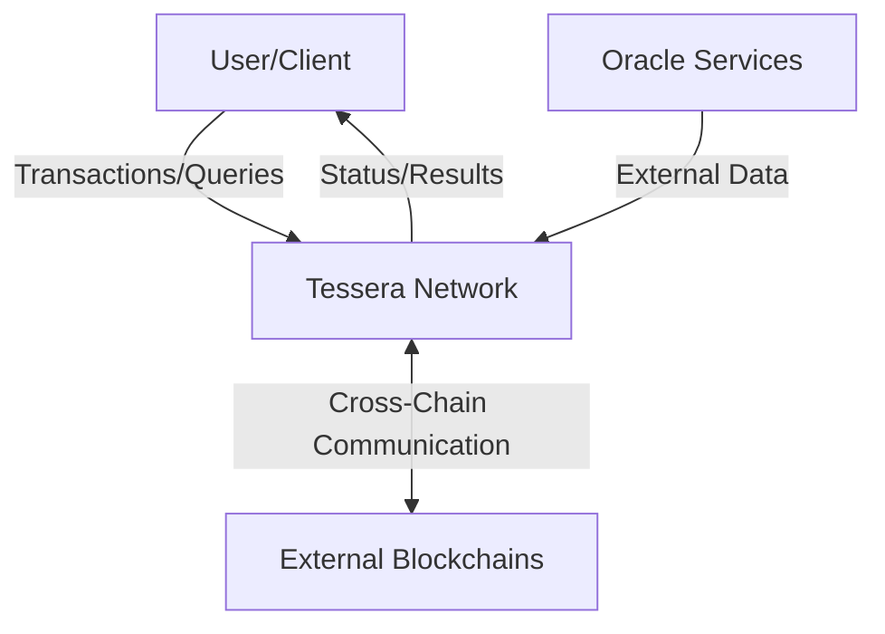
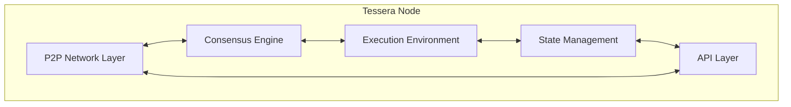
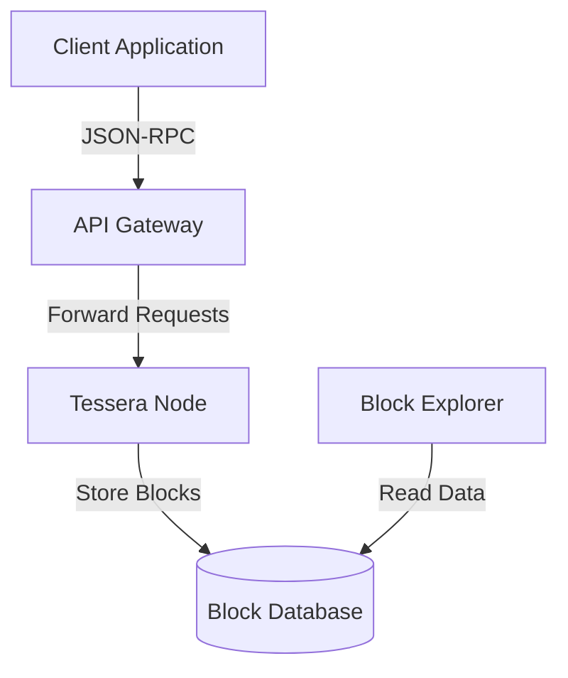
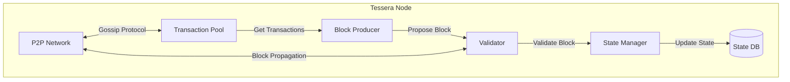
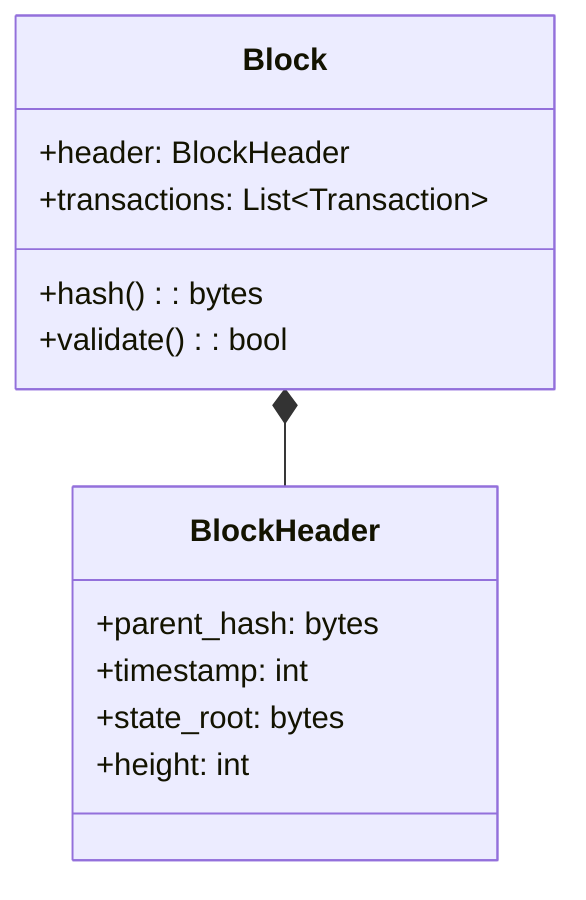
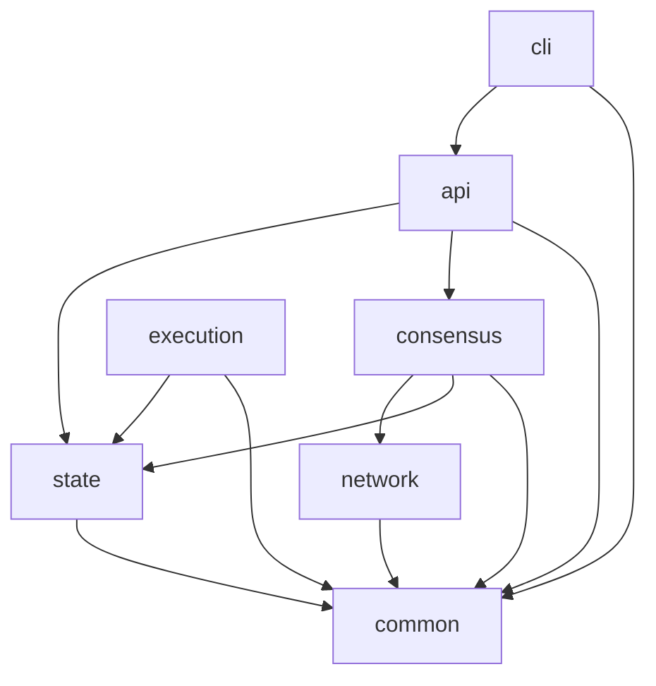
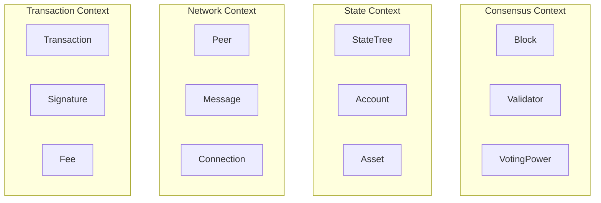
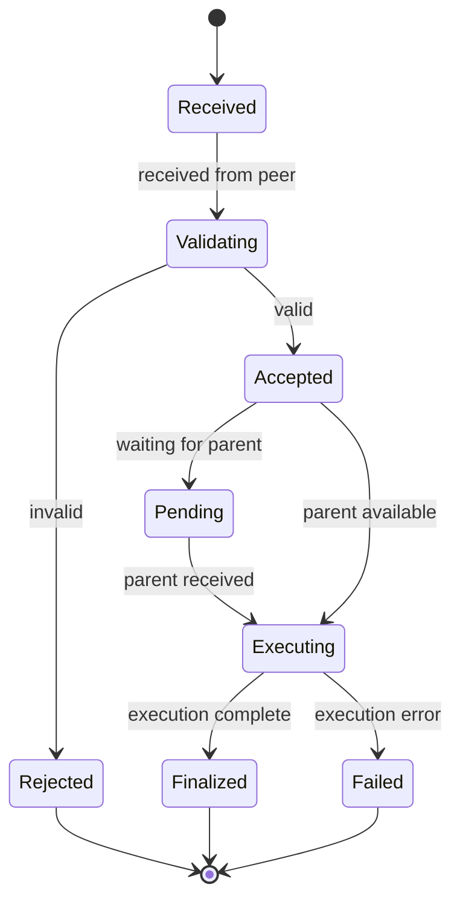
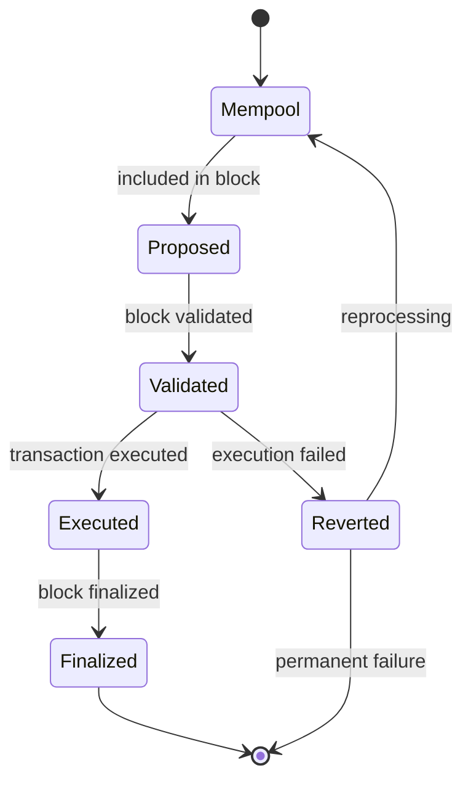

# 🏗️ Architecture Guidelines

This document outlines our architectural approach, standards, and best practices for the Tessera blockchain project. Following these guidelines ensures consistency and maintainability as our codebase evolves.

## 🎯 Architecture Philosophy

Our architecture follows these core principles:

1. **Modularity**: Clearly separated components with well-defined interfaces
2. **Separation of Concerns**: Each module has a single responsibility
3. **Testability**: Architecture supports comprehensive testing at all levels
4. **Scalability**: Design for growth in users, transactions, and data
5. **Evolvability**: Enable change without disrupting the entire system

## 🗺️ High-Level Architecture

### System Context



### Core Components



## 📂 Module Structure

```
jam/
├── network/           # P2P networking and message propagation
├── consensus/         # Consensus mechanisms (Safrole, etc.)
├── execution/         # Transaction execution environment
├── state/             # State management and persistence
├── api/               # RPC and REST interfaces
├── crypto/            # Cryptographic primitives
├── common/            # Shared utilities
└── cli/               # Command-line interface
```

## 📝 Architecture Decision Records (ADRs)

### Purpose

ADRs document significant architectural decisions, their context, and consequences. They provide:
- Historical record of decisions
- Context for understanding the codebase
- Onboarding material for new team members

### Template

```markdown
# ADR-NNNN: Title

## Status
[Proposed, Accepted, Deprecated, Superseded]

## Context
[Description of the problem and context]

## Decision
[Description of the decision made]

## Alternatives Considered
[Description of alternative options]

## Consequences
[Description of the resulting context after decision]

## Related Decisions
[Links to related ADRs]
```

### Example ADR

```markdown
# ADR-0001: Consensus Algorithm Selection

## Status
Accepted

## Context
The Tessera network requires a consensus mechanism that balances
security, decentralization, and throughput. We need to decide
on the primary consensus algorithm.

## Decision
We will implement the Safrole consensus protocol, a hybrid
proof-of-stake algorithm with deterministic block finality.

## Alternatives Considered
- Pure Proof of Work: Rejected due to energy consumption
- Proof of Authority: Rejected due to centralization concerns
- PBFT: Rejected due to scalability limitations

## Consequences
- We achieve ~5000 TPS with 100 validators
- Block finality occurs in ~2 seconds
- Requires validators to stake minimum 10,000 tokens
- Less energy-intensive than PoW alternatives

## Related Decisions
- ADR-0002: Validator Selection Mechanism
```

## 🧩 Component Visualization with C4 Model

We use the C4 model to visualize our architecture at different levels of detail:

### 1. System Context Diagram

Shows Tessera and how it relates to users and external systems.

### 2. Container Diagram

Shows the high-level technical components (applications, data stores, microservices).



### 3. Component Diagram

Shows components inside each container and their interactions.



### 4. Code Diagram

Shows how components are implemented in code (used sparingly).



## 🔍 Module Boundary Enforcement

### Allowed Dependencies



### Forbidden Dependencies

- Lower modules cannot depend on higher modules
- No circular dependencies between modules
- No direct dependencies that skip layers

### Enforcement

- Use `import-linter` in CI pipeline
- Configure with `.importlinter` file:

```ini
[importlinter]
root_package = jam
include_external_packages = False

[importlinter:contract:layers]
name = Layer Contract
type = layers
layers =
    jam.cli
    jam.api
    jam.consensus
    jam.execution
    jam.state
    jam.network
    jam.common
```

## 🧠 Domain-Driven Design

### Bounded Contexts



### Ubiquitous Language

Document domain terminology to ensure consistency:

| Term | Definition | Context |
|------|------------|---------|
| Block | Container of transactions with metadata | Consensus |
| Epoch | Fixed number of blocks with same validator set | Consensus |
| Finality | Point at which a block cannot be reverted | Consensus |
| Transaction | Signed user operation that changes state | Transaction |
| State Root | Merkle root hash of full system state | State |
| Validator | Node authorized to participate in consensus | Consensus |
| Peer | Connected node in the network | Network |

## 🔄 Interface-First Development

### Protocol

1. Define interface in `interface.py` file at module root
2. Review interface before implementation begins
3. Document with type hints and docstrings
4. Create tests against the interface
5. Implement concrete classes

### Example Interface

```python
# jam/consensus/interface.py

from abc import ABC, abstractmethod
from typing import List, Optional

from jam.common.types import Block, BlockHeader, ValidatorSet

class ConsensusEngine(ABC):
    """Interface for consensus algorithms."""
    
    @abstractmethod
    async def validate_block(self, block: Block) -> bool:
        """Verify block was produced according to consensus rules."""
        pass
    
    @abstractmethod
    async def propose_block(self, 
                          transactions: List[Transaction],
                          validator_set: ValidatorSet,
                          parent: BlockHeader) -> Block:
        """Create a new block proposal."""
        pass
    
    @abstractmethod
    async def finalize_block(self, block: Block) -> None:
        """Mark block as finalized."""
        pass
```

## 📋 Architecture Review Process

### Review Triggers

- Adding new modules
- Changing module interfaces
- Modifying core data structures
- Introducing new dependencies
- Changes impacting performance

### Review Template

```markdown
# Architecture Review: [Title]

## Overview
[Brief description of the change]

## Impact Areas
- [ ] Consensus
- [ ] State Management
- [ ] Networking
- [ ] APIs
- [ ] Security

## Questions
1. Does this change align with our architectural principles?
2. Are all cross-module dependencies appropriate?
3. Are interfaces well-defined and stable?
4. How does this impact performance?
5. Are there security implications?

## Decisions
[Document decisions made during review]
```

## ⚡ Performance Budget Framework

### Performance Metrics

| Component | Metric | Target | Critical Threshold |
|-----------|--------|--------|-------------------|
| Block Processing | Blocks per second | >10 | <5 |
| Transaction Validation | Txs per second | >5000 | <1000 |
| P2P Network | Message propagation | <500ms | >2s |
| State Access | Read latency | <10ms | >100ms |
| API | Response time | <100ms | >1s |
| Memory Usage | RAM per node | <4GB | >8GB |

### Monitoring

- Implement Prometheus metrics for all performance targets
- Create Grafana dashboards for visualization
- Set alerts for approaching thresholds
- Log detailed performance data during testing

## 🔄 State Transition Modeling

### Block Processing State Machine



### Transaction Lifecycle



## 💸 Technical Debt Tracking

### Debt Record Template

```markdown
# Technical Debt: [Identifier]

## Status
[Active, Planned, Resolved]

## Description
[Description of the debt]

## Impact
[How it affects the system]

## Remediation Cost
[Estimated effort to resolve]

## Business Impact
[How it affects users/operations]

## Remediation Plan
[How and when to address it]
```

### Debt Tracking Board

Maintain a Kanban board in GitHub Projects with columns:
- High Impact / High Cost
- High Impact / Low Cost
- Low Impact / Low Cost
- Low Impact / High Cost
- Scheduled for Remediation
- Completed

## 📡 Module Communication Patterns

### Synchronous Communication

For immediate operations within a process:
```python
# Direct method calls with error handling
try:
    result = state_manager.apply_transaction(tx)
except StateError as e:
    logger.error(f"Failed to apply transaction: {e}")
    raise ConsensusError("State transition failed") from e
```

### Asynchronous Communication

For operations that may take time:
```python
# Using asyncio
async def process_block(self, block: Block) -> None:
    validation_task = asyncio.create_task(self.validator.validate(block))
    try:
        is_valid = await asyncio.wait_for(validation_task, timeout=2.0)
        if is_valid:
            await self.state_manager.apply_block(block)
            await self.network.broadcast(BlockMessage(block))
    except asyncio.TimeoutError:
        logger.warning(f"Validation timed out for block {block.hash}")
```

### Event-Based Communication

For loose coupling between components:
```python
# Using an event system
class EventBus:
    def __init__(self):
        self.handlers = defaultdict(list)
        
    def subscribe(self, event_type: str, handler: Callable) -> None:
        self.handlers[event_type].append(handler)
        
    def publish(self, event_type: str, data: Any) -> None:
        for handler in self.handlers[event_type]:
            asyncio.create_task(handler(data))

# Usage
event_bus.subscribe("block_finalized", state_manager.apply_block)
event_bus.publish("block_finalized", new_block)
```

## 📊 Architecture Visualization Tools

### Recommended Tools

- **C4 Diagrams**: PlantUML with C4 macros
- **Sequence Diagrams**: Mermaid (in Markdown)
- **State Machines**: Mermaid stateDiagram
- **Class Diagrams**: Mermaid classDiagram
- **Module Dependencies**: pydeps or import-graph

### Integration

- Store diagrams as code in `/docs/architecture/diagrams/`
- Generate visualizations during documentation build
- Update diagrams when architecture changes
- Reference diagrams in ADRs and documentation

## 🏁 Architecture Governance

### Regular Reviews

- Monthly architecture sync meetings
- Quarterly architecture retrospectives
- Hands-on architecture workshops for major changes

### Roles

- **Architecture Owner**: Final decision authority
- **Module Owners**: Responsible for specific modules
- **Architecture Committee**: Reviews significant changes

### Documentation

- Keep Architecture Decision Records (ADRs) up-to-date
- Maintain living architecture document
- Document architectural principles and patterns
- Update diagrams as architecture evolves

## 📚 Resources

- [C4 Model](https://c4model.com/)
- [Architecture Decision Records](https://adr.github.io/)
- [Domain-Driven Design](https://domainlanguage.com/ddd/)
- [Clean Architecture](https://blog.cleancoder.com/uncle-bob/2012/08/13/the-clean-architecture.html)
- [Patterns of Enterprise Application Architecture](https://martinfowler.com/books/eaa.html)