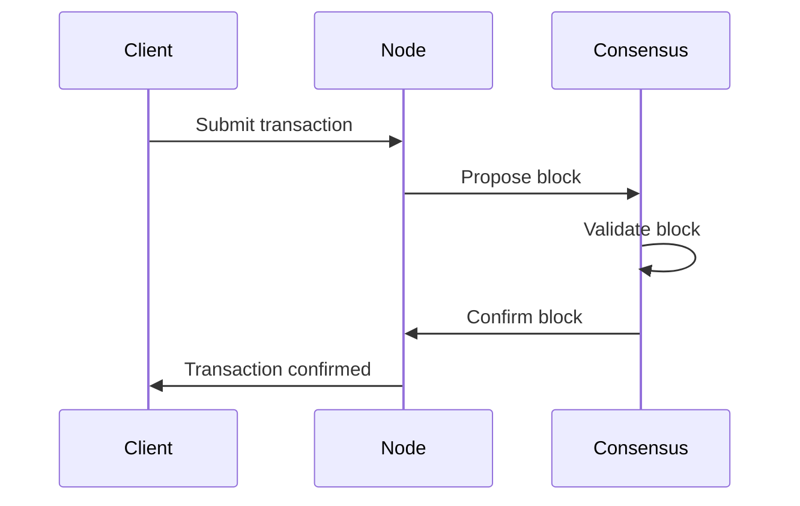

# 📚 Documentation Guidelines

This document outlines our documentation standards and best practices to ensure Tessera is well-documented for both users and developers.

## 🎯 Documentation Philosophy

Our documentation follows these core principles:

1. **Comprehensive**: Cover all aspects of the codebase
2. **Clear**: Easy to understand for both new and experienced users
3. **Current**: Always updated along with code changes
4. **Consistent**: Maintain uniform style and structure
5. **Accessible**: Organized in logical layers of complexity

## 📂 Documentation Structure

```
docs/
├── modules/           # Core module documentation
│   ├── introduction.rst
│   ├── installation.rst
│   ├── quickstart.rst
│   └── ...
├── api/               # API reference documentation
├── concepts/          # Conceptual explanations
├── guides/            # How-to guides
├── tutorials/         # Step-by-step tutorials
├── examples/          # Example code
└── dev/               # Developer documentation
    ├── architecture.rst
    ├── contributing.rst
    └── testing.rst
```

## 📝 Documentation Types

### 📘 Code Documentation

#### Docstrings

We use Google-style docstrings:

```python
def validate_block(block: Block, prev_block: Optional[Block] = None) -> bool:
    """Validate block integrity and relationship to previous block.
    
    This function performs full validation of a block, including:
    - Cryptographic integrity
    - Timestamp verification
    - Proper relationship to previous block (if provided)
    
    Args:
        block: The block to validate
        prev_block: Previous block in chain, if any
        
    Returns:
        True if block is valid, False otherwise
        
    Raises:
        TypeError: If block is not a Block instance
        
    Example:
        >>> genesis = Block.genesis()
        >>> new_block = Block.create(prev_hash=genesis.hash)
        >>> validate_block(new_block, genesis)
        True
    """
```

#### Module Documentation

Each module should have a module-level docstring:

```python
"""
Consensus module for Tessera.

This module implements consensus protocols including:
- Safrole proof-of-stake
- GRANDPA finality gadget

It provides the core logic for block production, validation,
and finalization in the Tessera blockchain.
"""
```

### 📖 Technical Documentation

Generated with [Sphinx](https://www.sphinx-doc.org/):

- API Reference: Generated from docstrings
- Architecture Documents: Custom RST/MD files
- How-To Guides: Step-by-step instructions for specific tasks

### 🏛️ Architectural Documentation

- Architecture Decision Records (ADRs)
- Component diagrams
- Data flow diagrams
- Protocol specifications

### 📔 User Documentation

- Installation guides
- User tutorials
- CLI documentation
- Configuration guides

## 🛠️ Documentation Tools

We use the following tools:

- **Sphinx**: Primary documentation generator
- **sphinx-autodoc**: API documentation from docstrings
- **sphinx-rtd-theme**: Documentation theme
- **sphinxcontrib-mermaid**: Diagrams support
- **sphinxcontrib-napoleon**: Google-style docstring support

## 📋 Documentation Standards

### 📊 General Style

- Use clear, concise language
- Prefer active voice
- Use present tense
- Avoid jargon where possible (or explain it)
- Include examples for complex concepts
- Use consistent terminology

### 🖼️ Diagrams

We use [Mermaid](https://mermaid-js.github.io/) for diagrams:



### 📄 Documentation Files

RST files should follow this structure:

```rst
=================
Component Title
=================

Brief description of the component.

Overview
--------

High-level overview of what this component does.

Key Features
-----------

* Feature 1: Description
* Feature 2: Description

Usage
-----

Basic usage example:

.. code-block:: python

    from jam.component import Feature
    
    feature = Feature()
    feature.run()

API Reference
------------

.. autoclass:: jam.component.Feature
    :members:
    :undoc-members:
```

## 🔄 Documentation Workflow

### 📝 Documenting New Features

1. **Write docstrings** as you code
2. **Update module docs** with new capability
3. **Add examples** demonstrating usage
4. **Update relevant guides**
5. **Build and verify** docs locally

### 🔍 Documentation Review

All PRs should include documentation:

- Docstrings for new code
- Updated documentation files if needed
- Documentation build must succeed

### 🚀 Documentation Deployment

Documentation is:
- Built and tested on each PR
- Automatically deployed from `main` branch
- Versioned for each significant release

## 📊 Blockchain-Specific Documentation

### 📘 Protocol Documentation

Document blockchain-specific concepts:

- Consensus mechanism details
- State transition rules
- Transaction formats
- Network protocol specifications
- Cryptographic primitives

### 📗 Architecture Documentation

Technical architecture details:

- Component interactions
- Data flow diagrams
- State management
- Security considerations
- Scalability design

### 📙 Operational Documentation

Running and maintaining nodes:

- Node setup instructions
- Configuration options
- Monitoring guidance
- Troubleshooting guides
- Performance tuning

## 🔍 Documentation Testing

- Check docs for broken links
- Verify examples actually work
- Test tutorials with new users
- Ensure documentation builds successfully

```bash
# Build documentation
cd docs
make html

# Check for broken links
sphinx-build -b linkcheck docs/ docs/_build/
```

## 📚 Resources

- [Google Developer Documentation Style Guide](https://developers.google.com/style)
- [Sphinx Documentation](https://www.sphinx-doc.org/)
- [Write the Docs Community](https://www.writethedocs.org/)
- [Diátaxis Documentation Framework](https://diataxis.fr/)
