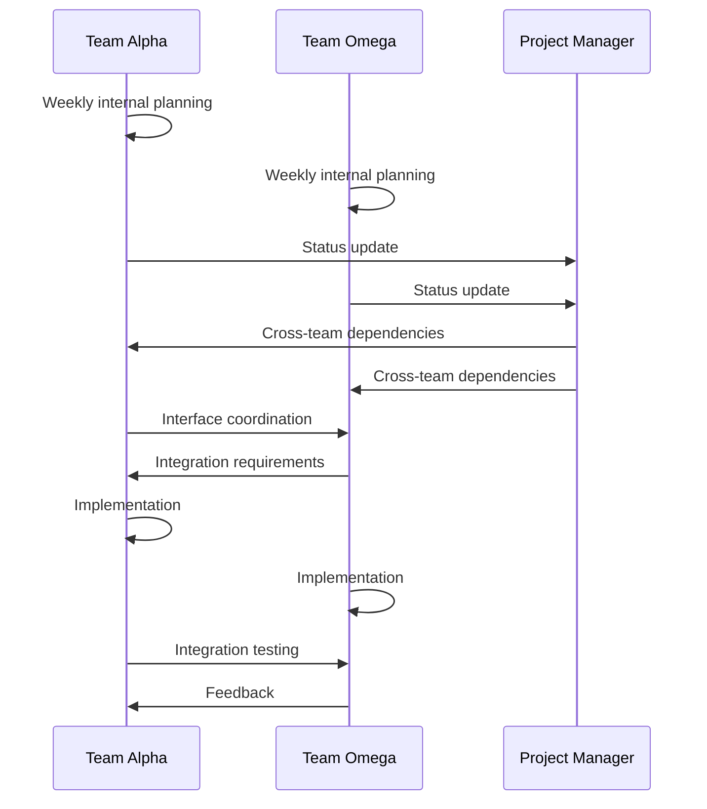

# 👥 Team Structure & Roles

### Project Manager

**Responsibilities:**
- Strategic project planning and roadmap development
- Tracking deliverables and milestones across both teams
- Resource allocation and capacity planning
- Cross-team coordination and dependency management
- Risk identification and mitigation
- Product backlog prioritization
- Regular progress tracking
- Sprint planning facilitation
- Removing obstacles for development teams

**Key Skills:**
- Project management methodology expertise
- Blockchain domain knowledge
- Strong communication skills
- Conflict resolution abilities
- Experience with agile development practices

### Tech Lead (Per Team)

**Responsibilities:**
- Technical direction and architecture for team focus areas
- Code quality oversight and technical debt management
- Team member mentoring and growth
- Technical decision-making
- Architecture implementation and enforcement
- Code review oversight
- Technical documentation approval
- Technical risk assessment
- Cross-team technical coordination
- Interface design between system components

**Key Skills:**
- Strong software architecture experience
- Deep blockchain technical knowledge
- Excellent code quality standards
- Team leadership capabilities
- Communication and teaching abilities

### Security Architect

**Responsibilities:**
- Security architecture and review
- Threat modeling for all components
- Security testing coordination
- Vulnerability management
- Audit preparation and remediation
- Security standards development
- Cryptographic implementation review
- Security incident response planning
- External security researcher coordination
- Blockchain-specific attack vector analysis

**Key Skills:**
- Cryptography expertise
- Blockchain security knowledge
- Secure coding practices
- Penetration testing experience
- Security audit experience

### DevOps Engineer

**Responsibilities:**
- CI/CD pipeline development and maintenance
- Testing infrastructure setup and maintenance
- Release management and deployment
- Environment management (dev, test, staging)
- Monitoring and alerting setup
- Performance testing infrastructure
- Docker/container management
- Cloud resource optimization
- Automation development
- Network simulation for blockchain testing

**Key Skills:**
- CI/CD tools expertise
- Cloud platform experience
- Infrastructure as code skills
- Monitoring system knowledge
- Blockchain node operation experience

### Documentation Manager

**Responsibilities:**
- Documentation strategy and standards
- API documentation oversight
- User guide development
- Technical content quality assurance
- Documentation automation
- Developer onboarding materials
- Architecture documentation
- Protocol specification maintenance
- Cross-team documentation consistency
- External documentation review

**Key Skills:**
- Technical writing expertise
- Documentation tools knowledge
- Information architecture skills
- Clear communication style
- Understanding of API documentation best practices

## 📢 Communication Structure

### Team Meetings

- **All-Hands**: Bi-weekly, whole team (60 minutes)
- **Tech Sync**: Weekly, Tech Leads + PM + Security Architect (30 minutes)
- **Team Standups**: Daily, per team (15 minutes)
- **Sprint Planning**: Bi-weekly, per team with PM (60 minutes)
- **Sprint Review**: Bi-weekly, per team with PM (60 minutes)
- **Retrospective**: Bi-weekly, per team (45 minutes)
- **Architecture Review**: Monthly, Tech Leads + Security Architect + key developers (90 minutes)

### Decision Making

#### Technical Decisions
- **Team-Specific**: Tech Lead has final authority
- **Cross-Team**: Both Tech Leads must agree, with Security Architect input
- **Project-Wide**: Tech Leads + PM + Security Architect consensus
- **Architecture Changes**: Requires ADR and approval from both Tech Leads

#### Project Decisions
- **Timeline/Scope**: PM with Tech Lead input
- **Resource Allocation**: PM with Tech Lead recommendations
- **Priority Shifts**: PM decision with team impact assessment

## 🔄 Team Interactions

### Cross-Team Collaboration

### Shared Responsibilities

| Responsibility | Team Alpha | Team Omega | Shared Roles |
|----------------|------------|------------|--------------|
| Architecture | Consensus & Network | Execution & API | Security & Integration |
| Performance | Network Throughput | Transaction Processing | Overall Benchmarks |
| Testing | Protocol Testing | API & Integration Testing | Security Testing |
| Documentation | Protocol Specs | API Docs | User Guides |
| Security | Network Security | Transaction Security | Overall Security Model |

## 📈 Career Growth

### Progression Paths

- **Technical Path**: Junior → Developer → Senior → Tech Lead → Principal Engineer
- **Management Path**: Developer → Tech Lead → Engineering Manager → Director
- **Specialization Path**: Developer → Specialist → Architect (Security/Performance/etc.)

### Skill Development Focus

- **Team Alpha**: Consensus algorithms, P2P networking, distributed systems
- **Team Omega**: State management, API design, developer experience
- **All Team Members**: Blockchain fundamentals, security best practices, testing

## 🎯 Performance Evaluation

### Key Performance Indicators

**Tech Leads:**
- Team velocity and delivery quality
- Technical debt management
- Architectural integrity maintenance
- Team member growth and development
- Cross-team collaboration effectiveness

**Project Manager:**
- Project milestones met
- Resource utilization efficiency
- Stakeholder satisfaction
- Risk mitigation effectiveness
- Team health and productivity

**Developers:**
- Code quality metrics
- Feature completion
- Technical documentation quality
- Testing coverage
- Knowledge sharing contributions

## 📝 Responsibility Assignment Matrix (RACI)

### Legend
- **R**: Responsible (does the work)
- **A**: Accountable (final decision authority)
- **C**: Consulted (provides input)
- **I**: Informed (kept up-to-date)

### Example Matrix

| Activity | PM | Tech Lead | Security Architect | DevOps | Team Member |
|----------|----|-----------|--------------------|--------|-------------|
| Sprint Planning | A | R/C | I | I | C |
| Architecture Decisions | I | R/A (area) | C | C | C |
| Code Reviews | I | A | C | I | R |
| Security Reviews | I | C | R/A | I | C |
| Deployment | C | C | C | R/A | I |
| Documentation | C | A (area) | C | I | R |
| Testing Strategy | C | A (area) | C | C | R |
| Release Planning | R/A | C | C | R | I |
| Production Issues | I | C | C | R | R |
