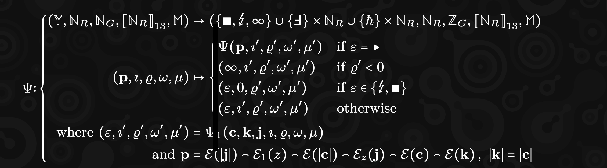

# PVM Notes

----
- $\mathbb{Y}$ = Program blob
- $\mathbb{N}_R$ = Registers [?] upto $2^{64}$
- $\mathbb{N}_G$ = Given Gas upto $2^{64}$
- $[\mathbb{N}_R]_{13}$ = Initial values for all 13 registers
- $\mathbb{M}$ = Memory state (sequence)

PVM function $\Psi$ takes in above input and returns:
- $\epsilon$ = exit reason: which is either ({□, ⚡️, ∞}) or (F - Page Fault along with the memory index) or (Host call along with memory index)
- $\mathbb{N}_R$ = Registers [?] upto $2^{64}$
- $\mathbb{Z}_G$ = Remaining Gas
- $[\mathbb{N}_R]_{13}$ = Output values for all 13 registers
- $\mathbb{M}$ = Memory state (sequence)

----

Recursively execute $\Psi$ till we reach HALT/PANIC

- p = Program instruction set
- **$\iota$** = Program counter
- $\varrho$ = Gas counter
- $\omega$ = Registers []
- $\mu$ = Memory sequuence

